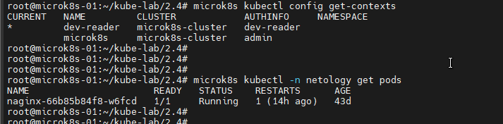

# Домашнее задание к занятию «Управление доступом»

### Цель задания

В тестовой среде Kubernetes нужно предоставить ограниченный доступ пользователю.

------

### Чеклист готовности к домашнему заданию

1. Установлено k8s-решение, например MicroK8S.
2. Установленный локальный kubectl.
3. Редактор YAML-файлов с подключённым github-репозиторием.

------

### Инструменты / дополнительные материалы, которые пригодятся для выполнения задания

1. [Описание](https://kubernetes.io/docs/reference/access-authn-authz/rbac/) RBAC.
2. [Пользователи и авторизация RBAC в Kubernetes](https://habr.com/ru/company/flant/blog/470503/).
3. [RBAC with Kubernetes in Minikube](https://medium.com/@HoussemDellai/rbac-with-kubernetes-in-minikube-4deed658ea7b).

------

### Задание 1. Создайте конфигурацию для подключения пользователя

1. Создайте и подпишите SSL-сертификат для подключения к кластеру.
2. Настройте конфигурационный файл kubectl для подключения.
3. Создайте роли и все необходимые настройки для пользователя.
4. Предусмотрите права пользователя. Пользователь может просматривать логи подов и их конфигурацию (`kubectl logs pod <pod_id>`, `kubectl describe pod <pod_id>`).
5. Предоставьте манифесты и скриншоты и/или вывод необходимых команд.

## Решение:

1. Генерирую ключ 
```openssl genrsa -out dev-reader.key 2048```
2. Создаю csr
```openssl req -new -key dev-reader.key -out dev-reader.csr -subj "/CN=dev-reader/O=dev"```
3. Выпускаю сертификат
```openssl x509 -req -in dev-reader.csr -CA /var/snap/microk8s/current/certs/ca.crt -CAkey /var/snap/microk8s/current/certs/ca.key -CAcreateserial -out dev-reader.crt -days 5000```
4. Создаю пользователя в Kubernetes
```microk8s kubectl config set-credentials dev-reader --client-certificate=dev-reader.crt --client-key=dev-reader.key --embed-certs=true```
5. Устанавливаю контекст использования
```microk8s kubectl config set-context dev-reader --cluster=microk8s-cluster --user=dev-reader```
6. Переключаюсь в контекст пользователя dev-reader
```microk8s kubectl config use-context dev-reader```
7. Проверяю текущий контекст и конфиг
```
microk8s kubectl config get-contexts
microk8s kubectl config view
```


8. Создаю Роль pod-reader с правами чтения логов подов и списка подов на уровне всего кластера
```
apiVersion: rbac.authorization.k8s.io/v1
kind: ClusterRole
metadata:
  name: pod-reader
rules:
- apiGroups: [""]
  resources: ["pods", "pods/log"]
  verbs: ["get", "watch", "list"]
```
9. Применяю роль
```microk8s kubectl apply -f clusterrole.yaml```
------

10. Добавляю группу dev (указана в сертификате) в роль
```
apiVersion: rbac.authorization.k8s.io/v1
kind: ClusterRoleBinding
metadata:
 name: pod-reader
subjects:
- kind: Group
 name: dev
 apiGroup: rbac.authorization.k8s.io
roleRef:
 kind: ClusterRole
 name: pod-reader
 apiGroup: rbac.authorization.k8s.io
```
11. Применяю привязку роли к группе
```microk8s kubectl apply -f clusterrolebindings.yaml```

12. Првоеряю налтичие доступа




Доступ под пользователем dev-reader есть.

### Правила приёма работы

1. Домашняя работа оформляется в своём Git-репозитории в файле README.md. Выполненное домашнее задание пришлите ссылкой на .md-файл в вашем репозитории.
2. Файл README.md должен содержать скриншоты вывода необходимых команд `kubectl`, скриншоты результатов.
3. Репозиторий должен содержать тексты манифестов или ссылки на них в файле README.md.

------
